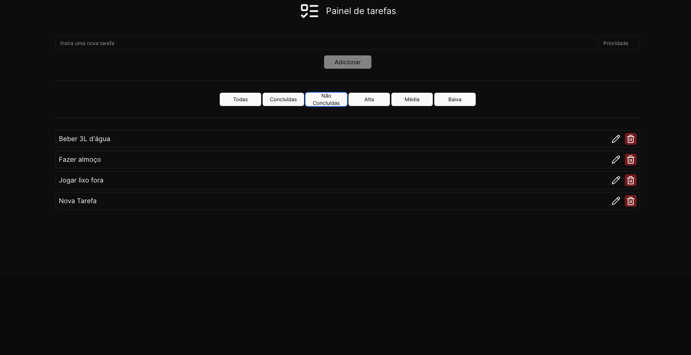

Esta é um aplicacao de Lista de Tarefas. 

# Para rodar o projeto na sua máquina

Primeiro, rode o server de desenvolvimento:

```bash
npm run dev
# ou
yarn dev
# ou
pnpm dev
# ou
bun dev
```

Acesse [http://localhost:3000/tasks](http://localhost:3000/tasks) com o seu navegador e veja o resultado.

# Como usar o app

## Ao iniciar você irá se deparar com a lista de tarefas vazia

<h1 display = "flex" align-items = "center">
    
</h1>

Em seguida, você pode preencher os campos com o título da tarefa e sua prioridade, respectivamente. O campo de prioridade é opcional; caso não receba nenhum valor, por padrão, receberá a prioridade 1.

## Após adicionar algumas tarefas voce irá se deparar com uma tela semelhante a esta

<h1 display = "flex" align-items = "center">
    
</h1>

Para marcar uma tarefa como concluída, basta clicar sobre o título da mesma. Para desmarcar, basta clicar novamente.

Para editar o título da tarefa, basta clicar no botão com o ícone de lápis.

Para remover alguma tarefa, basta clicar no botão com o ícone de lixeira.

As tarefas são organizadas de forma decrescente de acordo com sua prioridade, de 1 a 3, sendo 3 a maior. Por padrão, o filtro que mostrará todas as tarefas está habilitado.

## Filtros

### Tarefas Concluídas

<h1 display = "flex" align-items = "center">
    
</h1>

Ao clicar no botao "Concluídas", apenas as tarefas marcadas iráo ser exibidas.

### Tarefas Não Concluídas

<h1 display = "flex" align-items = "center">
    
</h1>

Ao clicar no botao "Não Concluídas", apenas as tarefas não marcadas irão ser exibidas.

### Tarefas de Alta Prioridade

<h1 display = "flex" align-items = "center">
    
</h1>

Ao clicar no botao "Alta", apenas as tarefas com prioridade 3 irão ser exibidas.

### Tarefas de Média Prioridade

<h1 display = "flex" align-items = "center">
    
</h1>

Ao clicar no botao "Média", apenas as tarefas com prioridade 2 irão ser exibidas.

### Tarefas de Baixa Prioridade

<h1 display = "flex" align-items = "center">
    
</h1>

Ao clicar no botao "Baixa", apenas as tarefas com prioridade 1 irão ser exibidas.

## Para o desenvolvimento deste projeto foram usadas as seguintes tecnologias

- [ReactJs](https://react.dev/learn)
- [Next.js](https://nextjs.org/docs)
- [Tailwindcss](https://tailwindcss.com/docs/installation)
- [Zod](https://zod.dev/)
- [uuid](https://www.npmjs.com/package/uuid)
- [Lucide-react](https://lucide.dev/)

## Para testar a aplicação foram usadas as seguintes tecnologias

- [React-testing-library](https://testing-library.com/docs/react-testing-library/intro/)
- [Jest](https://jestjs.io/docs/getting-started)

Foram desenvolvidos testes unitarios para os componentes da aplicação, onde foram testadas as seguintes funcionalidades:

- Criação de tarefas
- Listagem das tarefas
- Remoção de tarefas
- Filtros de exibição das tarefas

### Para rodar os testes

```bash
npm run test
# ou
yarn test
# ou
pnpm test
# ou
bun test
```
